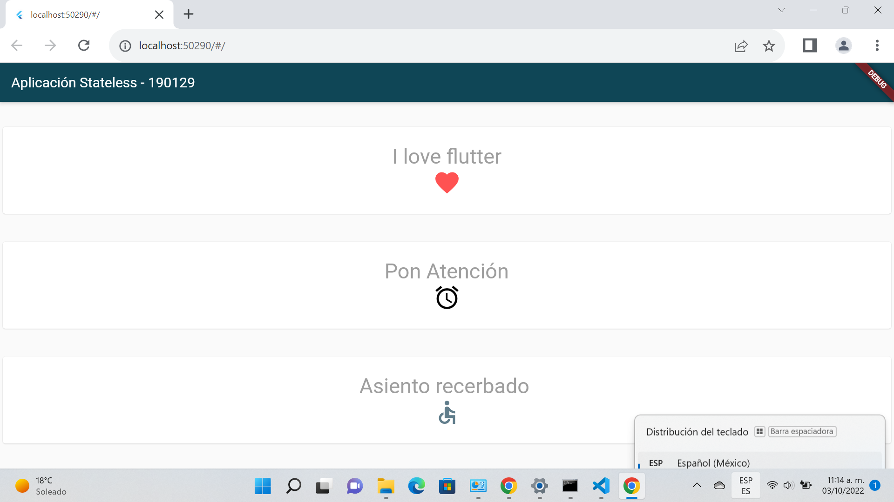

# Stateless Widget

## Datos Escolares

* Nombre: Eleazar Cortez Quirino
* Docente: M.T.I. Marco Antonio Ramirez Hernàndez

* Grado/Grupo: 10º "A"
* Periodo: Septiembre-Diciembre

---

## Objetivo

> El objetico de este proyecto es implementar Stateless widgets con diferenres servidores que entregan diferente informacion al mismo tiempo, al igual que las peticiones sean independientes y no dependan de resultados anteriores

---

## Metodologia

> Para poder lograr la implementacion de Stateless widgets se realizo una investigacion de su comportamiento y el como se puede implementar a travez de trabajos escolares y laborales.

## Herramientas implementadas:

* Flutter
* Visual Studio Code

---

## Visualizaciòn de la Pagina
 Nos muestra tres textos y cada uno con distintos iconos, aqui nos permite identificar que los iconos y los textos no cambiaran, en eso consiste el Wiget Stateless.
***

***
## Elaborado por:
ING. Eleazar Cortez Quirino
***

